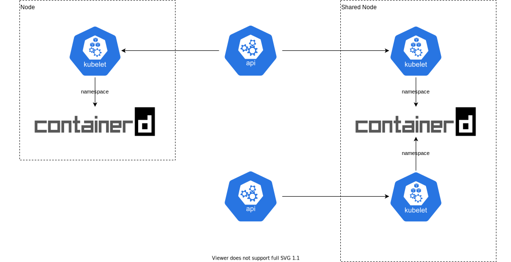

# CaaS

How to share nodes between Kubernetes controlplanes.

## Using [containerd](containerd.io) [namespaces](https://github.com/containerd/containerd/blob/release/1.3/docs/namespaces.md)

[namespaces](https://github.com/containerd/containerd/blob/release/1.3/docs/namespaces.md) allow a multi-tenancy on the same `containerd` instance.

This is pretty easy to use and only need an hack on [containerd-cri](https://github.com/containerd/cri) to be able to specify a namespace name (currently hardcoded to `k8s.io`).
https://github.com/containerd/cri/issues/1396

## Shared `kubelet`

It's also possible to implement multi-tenancy inside `kubelet` daemon.
This is not easy to do and needs all kind of new options.

## CaaS service

A CaaS can be seen as a simple distributed container runner.
There is multiple ways to connect it to Kubernetes.

### Implementation

We are not talking right now about how to implement it.

### Kubernetes Connection

#### [Virtual Kubelet](https://virtual-kubelet.io/)

Virtual Kubelet is a project made to use CaaS inside kubernetes.
It "emulate" a `kubelet` to be seen as a huge node by `scheduler`.

#### meta `kubelet`

The CaaS can also implement a `kubelet` that connect directly to the API.

#### meta [CRI](https://github.com/kubernetes/cri-api/)

`kubelet` is using CRI call to spawn a pod.

CaaS can implement a CRI connector.

### Kubernetes architecture

Current `kubelet` implementation do some "Kubernetes-only" stuff, like checks (readiness, liveness).
Exec/Logs are implemented in CRI api.

This "stuff" should be implement inside CaaS, or should be extract in another controller managing the way pods are changing states based on Kubernetes constraints.
